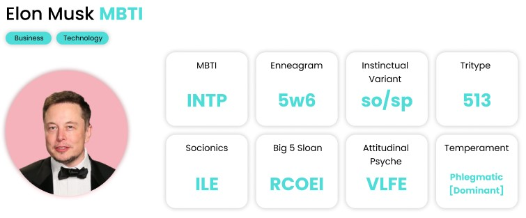
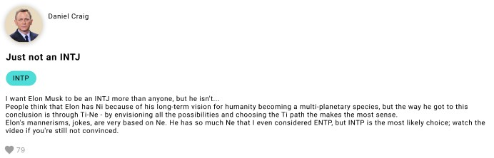

`Boo Dating App` is a Node.js app where you can meet new people by personality

## Description

---

Boo coding assignment

---

## Usage

---

### Prerequisites

You should set up the following environmental variables before running and/or dockerizing the app

| Variable    | Description           |
| ----------- | --------------------- |
| DB_USER     | MongoDB username      |
| DB_PASSWORD | MongoDB password      |
| DB_ADDRESS  | MongoDB address       |
| DB_NAME     | MongoDB database name |

#### API

`/profile/:id`,

View profile by ID

---

`/create`,

Create profile, only name is required

---

`/api/comment/new`,

Leave a comment and vote on what you think the celebrity's personality is. Voting is optional.

##### Voting Options

1. MBTI
2. Enneagram
3. Zodiac

